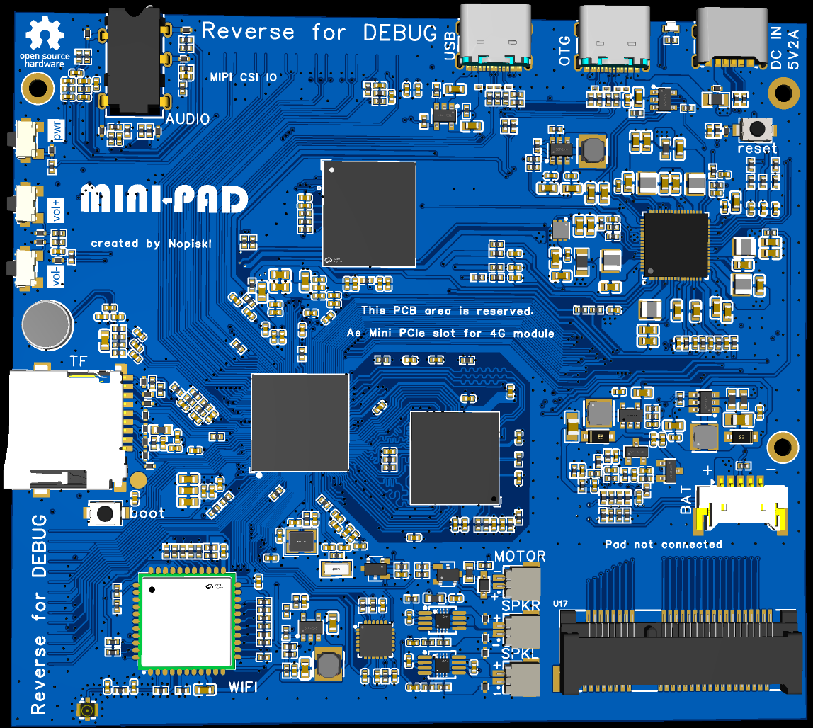
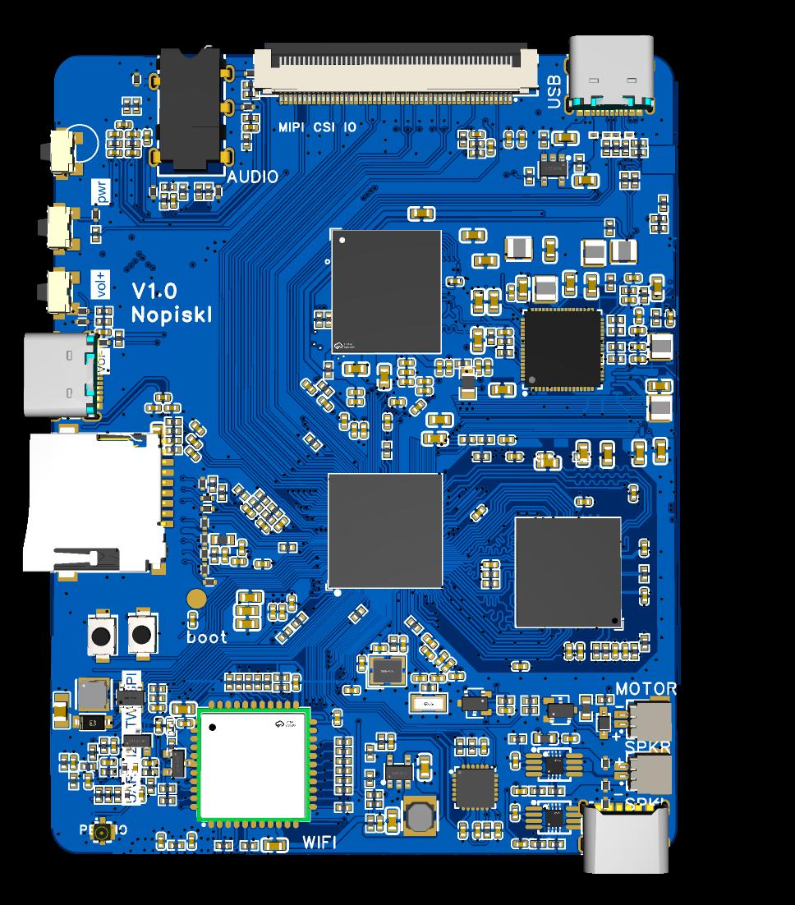

# Nopiskl-a133 TinaLinux SDK

**Language:** English | [中文](README_CN.md)

This repository collects software and hardware adaptation materials for the Allwinner A133 platform. It is intended to provide reusable Linux, Ubuntu TinaLinux, and Android adaptation resources for the `nopiskl-a133` board.

The current project mainly targets smart microphone products, portable terminals, signage devices, MP4-like handhelds, and phone-like Android devices. The repository includes board-level configuration, device trees, kernel configuration, filesystem adaptation materials, hardware files, and selected reference images.

## Hardware And System Preview

<p align="center">
  <table>
    <tr>
      <td align="center">
        
        <br />
        <sub>Mini-PAD hardware v1.0 render</sub>
      </td>
      <td align="center">
        
        <br />
        <sub>Hardware v2.0 reference layout</sub>
      </td>
      <td align="center">
        
        <br />
        <sub>Android 10 test screen</sub>
      </td>
    </tr>
  </table>
</p>

## Project Status

The following directions have been organized and verified so far:

| Direction | Status | Typical Use Cases |
| --- | --- | --- |
| TinaLinux | Suitable as the main production configuration for continued development | Embedded products, Qt applications, hardware codec, GPU acceleration, OTA, and boot self-test |
| TinaLinux Ubuntu | Suitable for Ubuntu base rootfs development | Minimal smart signage, portable terminals, and general Linux application validation |
| Android 10/13 | Adapted from the KICKPI and 100ASK solutions | Android MP4 devices, phone-like devices, dictionary pens, and other Android application scenarios |

The camera pipeline is still being adapted. Hardware codec and GPU acceleration materials have already been organized, but behavior differs across rootfs and desktop environments. Choose the filesystem according to the notes below.

## Hardware Versions

| Version | Directory | Content |
| --- | --- | --- |
| v1.0 | `A133_Hardware/Hardware/v1.0` | Mini-PAD / A133 tablet hardware materials |
| v2.0 | `A133_Hardware/Hardware/v2.0` | A133 reference layout hardware materials |

## Directory Overview

```text
A133_Hardware/
  Hardware/                     Hardware project files
    v1.0/                       Mini-PAD / A133 tablet hardware materials
    v2.0/                       Earlier A133 reference hardware materials
  TestImage/                    Test images or reference output
  Design_References/            Kickpi and vendor reference materials
    Kickpi_Board_Drawings/      Kickpi board drawings
    Vendor_References/          Vendor reference materials

Android/
  READEME.md                    Android adaptation notes

Linux/
  Custom_A133_Codec_Port/       Cedar/Codec related adaptation files
  Custom_A133_Qt_GPU_Rootfs/    Qt + GPU filesystem materials
  v1.0/                         TinaLinux adaptation for the current hardware version
    Tina4_KICKPI_suitable/      Tina4/KICKPI related adaptation materials
    Tina4_SDK_Industrial_ROS/   Tina4 Industrial ROS adaptation materials
    Tina5_SDK/                  Standard Tina5 Linux SDK adaptation materials
    Tina5_SDK-ubuntu/           Tina5 Ubuntu SDK adaptation materials
  v2.0/                         Archived TinaLinux materials before migration
    Tina4_KICKPI_suitable/
    Tina4_SDK_Industrial_ROS/
    Tina5_SDK/
    Tina5_SDK-ubuntu/
```

`Linux/v1.0` has been reorganized from the A133 `c3` board configuration. It keeps the important board-level DTS/FEX files, partition and environment configuration, boot resources, required binaries, WiFi firmware, and SDK build entry points. The current `board.dts` uses the `default_lcd` RGB 1024x600 configuration, so v1.0 no longer includes the old `mipi_5_720x1280` panel driver snippets. `Linux/v2.0` keeps the older TinaSDK tree before migration so historical differences can still be checked.

## Choosing A System Direction

### 1. TinaLinux

TinaLinux is currently the better direction for product development. It follows the complete Allwinner SDK flow and is suitable for stable board-level systems, dynamic OTA, boot self-test, hardware codec, and GPU acceleration.

Recommended uses:

- Qt + GPU application development
- Hardware codec validation
- Camera pipeline bring-up
- Embedded products that need the Allwinner production flow

### 2. TinaLinux Ubuntu

TinaLinux Ubuntu is better suited for general Linux application validation. It can run common Linux software and can be used as the base system for minimal smart signage, portable terminals, or lightweight desktop devices.

Notes:

- Hardware codec and GPU adaptation materials have been organized.
- Full GPU acceleration should not be assumed in XFCE/Wayland desktop environments.
- If GPU or Qt is the priority, use the `QT+GPU` rootfs direction and disable desktop environments such as XFCE.
- If desktop usability is the priority, use the `xfce` rootfs direction.

### 3. Android 10/13

The Android direction is adapted from the KICKPI Android 10 solution and the 100ASK Android solution. It is closer to a standard Android phone model, but it does not include baseband or cellular network adaptation.

Recommended uses:

- Android MP4 devices
- Portable smart terminals
- Phone-like devices
- Dictionary pens and other Android product forms

More details:

```text
Android/READEME.md
```

## TinaLinux Ubuntu Build Flow

The following flow applies to:

```text
Linux/v1.0/Tina5_SDK-ubuntu
```

For the full SDK build flow, refer to the KICKPI documentation:

```text
https://gitee.com/tanzhtanzh/kickpi-book/blob/master/a133/zh/
```

Choose a rootfs according to the target use:

- If XFCE desktop is required, use a rootfs whose name starts with `(xfce)`, or use the rootfs provided by KICKPI.
- If Qt + GPU is required, use a rootfs whose name starts with `(QT+GPU)`, and extract `overlay.tar` into the SDK `overlay` directory.

Place the selected rootfs under:

```text
a133-linux/device/config/rootfs_tar/
```

Rename it to:

```text
rootfs_ubuntu_nopiskl_k5_1604lts.tar.gz
```

Then select the following board configuration:

```text
BoardConfig-a133-nopiskl-a133.mk
```

## Tina4 SDK Development Notes

For Tina4 SDK development, refer to the 100ASK R818 DshanPI ROSx development environment guide:

```text
https://docs.100ask.net/dshanpi/docs/R818-DshanPI-ROSx/part3/DevelopmentEnvironmentSetup
```

Basic flow:

1. Obtain the Tina4 SDK.
2. Set up the build environment according to the 100ASK documentation.
3. Overlay the corresponding SDK files with `Linux/v1.0/Tina4_SDK_Industrial_ROS` from this repository.
4. Select the configuration and build according to the 100ASK flow.

For packaging notes, see:

```text
Linux/v1.0/Tina4_SDK_Industrial_ROS/READEME.md
```

## Standard Tina5 SDK Development Notes

For the standard Tina5 SDK, refer to the 100ASK A133 mCore documentation:

```text
https://dshanpi.100ask.net/docs/A133-mCore/SourceCodeToolDocumentationManual/
```

The corresponding adaptation directory in this repository is:

```text
Linux/v1.0/Tina5_SDK
```

## Recommendations

- If the target is a production embedded Linux product, start with `Linux/v1.0/Tina5_SDK` or the TinaLinux direction.
- If the target is general Linux software validation, start with `Linux/v1.0/Tina5_SDK-ubuntu`.
- If the target is the Android application ecosystem, refer to the `Android` directory.
- After changing the device tree or defconfig, run a full rebuild and flash test, especially for power, display, touch, WiFi/BT, audio, and storage related configuration.

## Acknowledgements And References

This project references the Allwinner Tina SDK, KICKPI A133 materials, and 100ASK DshanPI/A133 documentation. Related links are listed in the corresponding sections.
